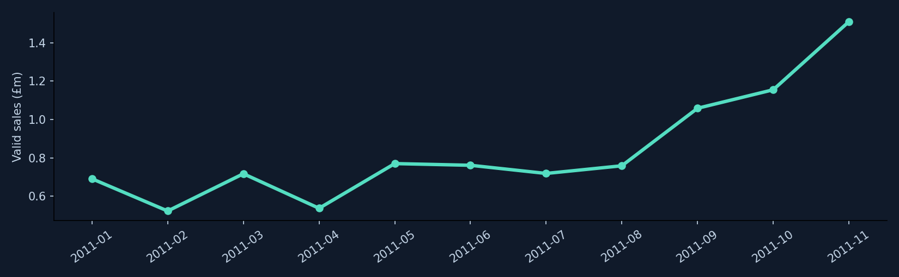
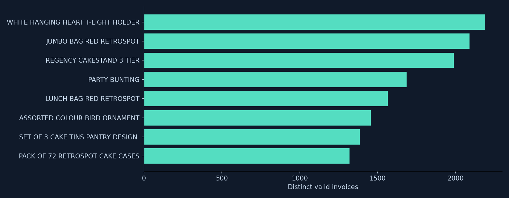

# Retail Growth & Retention Decision Studio

**Business question:** Which customer and product opportunities should a UK online retailer prioritise?

## Use the website

**[Open the live retail campaign planner](https://banoth281.github.io/retail-growth-retention-decision-studio/#scenario)**. This is a small business decision tool on the public site, followed by the historical case study and current ONS market context.

Enter your own assumptions:

| Input | Example | Meaning |
| --- | ---: | --- |
| Customers reached | 1,000 | Distinct people who receive the campaign |
| Expected conversion | 5% | Share expected to place one additional order |
| Average order value | £50 | Value per additional order |
| Gross margin | 40% | Share left after cost of goods, before campaign spend |
| Campaign spend | £500 | Incremental marketing cost |

With the example, the planner estimates **50 extra orders**, **£2,500 incremental sales**, **£500 contribution after campaign spend**, and **2.5% break-even conversion**. A sensitivity table shows how lower and higher conversion assumptions change the outcome. Click **Download scenario CSV** to save your own assumptions and results.

Formulas:

```text
Expected extra orders = customers reached × conversion rate
Incremental sales = expected extra orders × average order value
Contribution after spend = incremental sales × gross margin rate − campaign spend
Break-even conversion rate = campaign spend ÷ (customers reached × average order value × gross margin rate)
```

**Limits:** This is a scenario, not a forecast, net profit figure or measured campaign outcome. Returns, VAT, fulfilment and overhead are excluded. The break-even result says “Not reachable” if positive spend cannot be covered under the inputs. Your numbers run in your browser and are not sent to a server. The UCI and ONS datasets do **not** set the default assumptions.

[Open the market explorer](https://banoth281.github.io/retail-growth-retention-decision-studio/#explorer) · [View the generated report](report.html) · [View the Python analysis](analyze.py) · [View planner code](campaign.js)



This portfolio project analyses UCI's **Online Retail** dataset: historical transactions from a UK-based online retailer between December 2010 and December 2011. It is a real public dataset, not current business activity. Source credit: Chen, D. (2015), *Online Retail*, UCI Machine Learning Repository, https://doi.org/10.24432/C5BW33, licensed CC BY 4.0. No source records were altered in the supplied workbook; the analysis creates derived outputs.

## Website walkthrough

The [live case study](https://banoth281.github.io/retail-growth-retention-decision-studio/) is designed for a quick recruiter review:

1. **Start with the business question and decision summary** on the landing screen.
2. Use the **2026 context** link for the separately sourced ONS market series.
3. Use **Market explorer** to filter the 2010–11 retailer's valid transaction lines and export aggregated CSV.
4. Read **Analysis** for monthly patterns, invoice-level product demand and cohort retention.
5. Use **Campaign planner** to test your own campaign costs, margin and break-even assumptions.
6. Open **Methods** for exclusions, limitations and source links.

The site works on desktop and mobile, with keyboard navigation and readable table scrolling. The HTML is generated by [`analyze.py`](analyze.py), uses [`style.css`](style.css), and is published through GitHub Pages from [`index.html`](index.html). The planner is a usable browser tool and the accompanying analysis is a portfolio case study; no campaign outcome or employer result is claimed.

## Current UK retail market context (2026)

[Open the ONS market context panel](https://banoth281.github.io/retail-growth-retention-decision-studio/#current-market). It uses the Office for National Statistics (ONS) [Retail Sales Index internet sales workbook](https://www.ons.gov.uk/businessindustryandtrade/retailindustry/datasets/retailsalesindexinternetsales), released **18 September 2026**, with monthly observations through **August 2026**.

- **28.8%** of Great Britain's retail sales excluding automotive fuel were made online in August 2026 (seasonally adjusted, ONS series **MS6Y**).
- **£2,827.9 million** was the seasonally adjusted **average weekly** online sales value in August 2026 (ONS series **MZX6**). This is not monthly revenue.
- The panel plots the monthly online share for 2026. The source includes 2025 and 2026 observations in [`outputs/ons_market.json`](outputs/ons_market.json).

**Interpretation:** These are *national market indicators*, not transactions from the retailer in the UCI case study. Do not add the ONS amount to that retailer's revenue or treat the UK market trend as its growth. ONS may revise past values in later releases. The case study's customer retention and product findings remain historical.

To refresh the ONS panel after a new official release, run this in the project folder:

```powershell
python ons_context.py
python analyze.py
Copy-Item report.html index.html
python -m unittest discover -s tests -v
```

[`ons_context.py`](ons_context.py) downloads the current official workbook, reads the two named series by their ONS IDs, checks month alignment and writes the small JSON summary. Review the output and commit `outputs/ons_market.json`, `report.html` and `index.html` to publish an updated static demo. The test fixture checks that a later revision table cannot overwrite the main series.

## Explore markets with real data

[Open the interactive market explorer](https://banoth281.github.io/retail-growth-retention-decision-studio/#explorer) near the top of the dashboard:

1. Select a **country** or keep **All countries**.
2. Select a **month** or keep **All months**.
3. Compare the filtered **positive sales line value**, **valid sale lines**, and **share of all valid sales**. Inspect the monthly trend below the filters.
4. Select **Download filtered CSV** to inspect the aggregated country-month rows in Excel or another tool. The export does not contain customer records.

For a quick demo, choose **France** and then switch between **All months** and a month in 2011. The numbers and trend come from the UCI workbook processed by [`analyze.py`](analyze.py), using the same valid-sale rule as the headline KPI. The market aggregation is checked against the headline sales value and valid sale-line count in [the tests](tests/test_metrics.py). A valid sale line is a transaction line, not an invoice or customer. Country is the value recorded in the source. The trend shows full months January–November 2011; **All months** KPIs also include December 2010 and the partial December 2011.

## Get the data and run locally (Windows, Python 3.10+)

The dataset is [Online Retail at UCI](https://archive.ics.uci.edu/dataset/352/online+retail). You can [download the source ZIP directly](https://archive.ics.uci.edu/static/public/352/online+retail.zip), extract `Online Retail.xlsx`, and put it in a `data` folder next to `analyze.py`. **You can also skip this download:** `python analyze.py` fetches and saves the workbook automatically on first run.

Open a PowerShell terminal in the repository folder:

```powershell
python -m pip install -r requirements.txt
python ons_context.py
python analyze.py
Copy-Item report.html index.html
python -m unittest discover -s tests -v
start report.html
```

The source workbook is not committed to GitHub. The first run downloads about 24 MB; later runs reuse `data/Online Retail.xlsx`. The script writes `report.html`, `outputs/metrics.json`, and `outputs/retail.db`. The separate downloadable project ZIP includes the workbook for offline analysis.

## What the analysis found

| Measure | Result | Interpretation |
| --- | ---: | --- |
| Valid invoices | 19,960 | Positive-quantity, positive-price, non-cancellation invoices |
| Identified customers | 4,338 | Customers with an ID on a valid sale |
| Repeat customer rate | 65.6% | At least two distinct valid invoices in the observed period |
| Recorded positive line value | £10.67m | Includes some charge lines; **not profit** |



## Definitions and decisions

* **Valid sales:** invoice does not start with `C`; positive quantity and unit price. Recorded sales value = quantity × unit price. Some invoice lines are charges such as postage; the headline may include these and is **not profit**.
* **Cancellations:** count lines with invoice starting `C` or negative quantity separately. This is an operational signal, **not a true refund rate**: original purchases and cancellation lines are not linked reliably here.
* **Customer repeat rate:** customers with at least two distinct valid invoices divided by identified customers. Guest/unknown IDs are excluded.
* **Cohort retention:** customers whose first observed purchase was in a given month and who returned in a later month, divided by cohort size. This is observed-period retention, not lifetime retention; the early data may also include existing customers.
* **Product ranking:** distinct valid invoice count, excluding known postage/manual charge codes. It measures breadth of observed demand rather than profit or stock requirements.

The December 2011 source is partial, ending 9 December. The monthly revenue chart excludes it and uses January–November 2011; cohort month 1 uses cohorts from December 2010 through October 2011 so a subsequent month is observable.

## Evidence for recruiters

The report includes a source and methods panel, KPI cards, interactive country/month market explorer with CSV export, monthly trend, product ranking, cohort retention table and a separate what-if sales calculator. The SQLite database supports ad hoc SQL review. `sql/analysis.sql` supplies reconciliation and segment queries. The Python tests check revenue filtering, cancellation handling, cohort denominators and the ONS parser; the JavaScript tests check planner arithmetic and break-even edge cases.

This is an analysis case study, not a live shop. Suggested next milestone: turn the findings into a Power BI dashboard with slicers and document one business decision and its assumptions.
